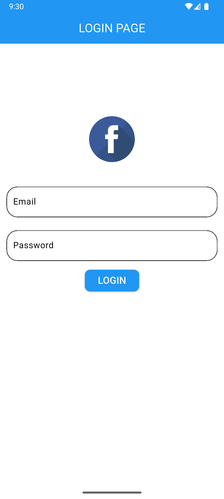

# Flutter Login UI with Shared Preferences

A simple Flutter application demonstrating a login flow using `SharedPreferences` for persistent login state.

---

## Features 🚀
- ✅ Splash screen to check login status
- 🎨 Login UI (basic design)
- 💾 Local session management using SharedPreferences
- 🔁 Seamless navigation between login and home screens based on session
- 🔓 Logout button to clear session and redirect

---

## Screenshots 📸
### **Splash Screen**
The splash screen checks `SharedPreferences` for a login session. If the user is logged in (`isLoggedIn: true`), it navigates to the Home screen. If not, it goes to the Login page.

### **Login Page**
Users can input credentials here. Upon successful login, the `isLoggedIn` flag is set to `true` in `SharedPreferences`, allowing the app to remember the login state.

### **Home Page**
Once logged in, users are redirected to the Home page. The session is verified using `SharedPreferences`, ensuring access only for logged-in users.

---

## SharedPreferences Navigation 💡
- **Splash Screen** checks `isLoggedIn` in `SharedPreferences` to decide whether to show the Login page or Home screen.
- After login, `isLoggedIn` is set to `true` in `SharedPreferences`.
- On logout, `isLoggedIn` is set to `false`, redirecting users to the Login page on the next app launch.

---

## Dependencies ⚙️

This project uses the following dependencies:

- [`shared_preferences`](https://pub.dev/packages/shared_preferences): A Flutter plugin to persist simple data in key-value pairs for local storage.

---

##  Tech Stack 🛠️
- **Flutter**: Framework for building the app
- **SQLite & sqflite**: Local database storage solution used for CRUD operations on notes
- **Dart**: Programming language used in Flutter for the development of the app.
- **VS Code / Android Studio**: Integrated Development Environments (IDEs) used for coding and testing the app.
- **Git**: Version control tool for source code management.