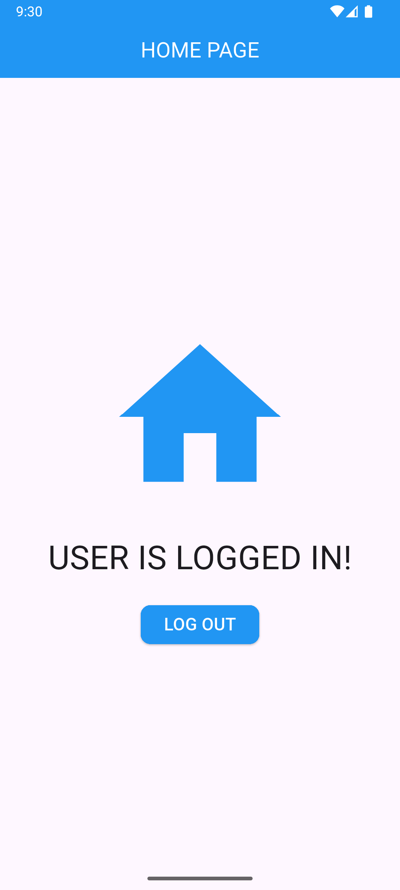

# Flutter Login UI with Shared Preferences

A simple Flutter application demonstrating a login flow using `SharedPreferences` for persistent login state.

## Features 🚀
- ✅ Splash screen to check login status
- 🎨 Login UI (basic design)
- 💾 Local session management using SharedPreferences
- 🔁 Seamless navigation between login and home screens based on session
- 🔓 Logout button to clear session and redirect

## Screenshots 📸
### **Splash Screen**
The splash screen checks `SharedPreferences` for a login session. If the user is logged in (`isLoggedIn: true`), it navigates to the Home screen. If not, it goes to the Login page.

### **Login Page**
Users can input credentials here. Upon successful login, the `isLoggedIn` flag is set to `true` in `SharedPreferences`, allowing the app to remember the login state.

### **Home Page**
Once logged in, users are redirected to the Home page. The session is verified using `SharedPreferences`, ensuring access only for logged-in users.

## SharedPreferences Navigation 💡
- **Splash Screen** checks `isLoggedIn` in `SharedPreferences` to decide whether to show the Login page or Home screen.
- After login, `isLoggedIn` is set to `true` in `SharedPreferences`.
- On logout, `isLoggedIn` is set to `false`, redirecting users to the Login page on the next app launch.